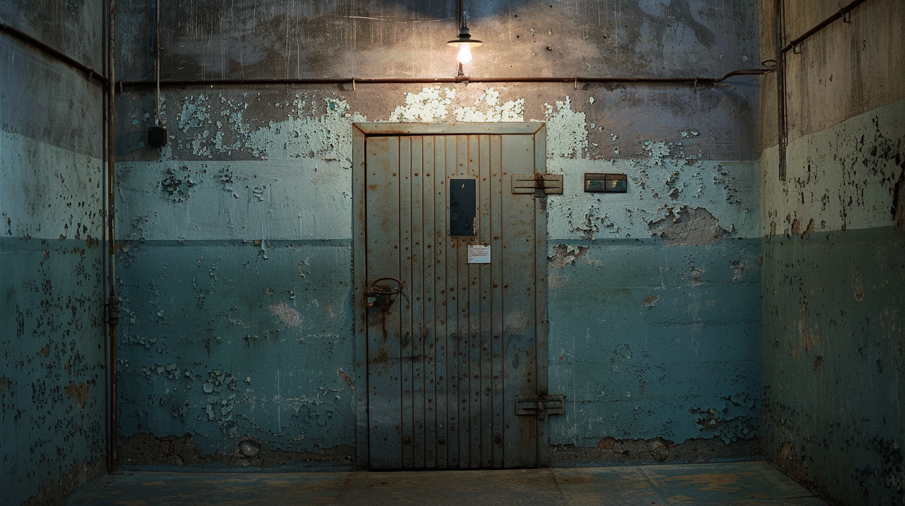

# The Grinder: How Belarus Prosecutes Political Dissent



A charge co-occurrence analysis of 8,689 politically motivated prosecutions in Belarus (2020-2026), revealing a repressive apparatus that is not ratcheting through discrete steps but grinding itself flat: collapsing distinct charging regimes into a single undifferentiated machine.

**[Read the report →](https://www.traceoriginresearch.com/what-a-knowledge-graph-found-in-3-829-belarusian-charge-sheets-that-no-single-case-file-could-show/)** · **[Russia companion analysis →](https://www.traceoriginresearch.com/what-a-knowledge-graph-found-in-7-111-russian-prosecution-records-that-no-single-case-file-could-show/)** · **[Myanmar companion analysis →](https://www.traceoriginresearch.com/what-a-knowledge-graph-found-in-31-824-myanmar-detention-records-a-civilian-legal-system-being-replaced-by-a-military-one/)**

## Findings

**Four communities** identified by unsupervised Louvain community detection, collapsing over time:

| Cluster | Function | Key articles | Persecutions |
|---------|----------|-------------|-------------|
| Mass protest | Public disorder production line | Art. 342 | 3,788 |
| Presidential insult | Speech stacking | Art. 368, 369, 130 | 3,300 |
| Extremist formations | Organizational persecution | Art. 361-4, 361-1, 361 | 1,200+ |
| Terrorism | Heavy charges | Art. 289 | <50 |

**The grinder, not a ratchet.** Modularity collapsed from 0.26 (2020) to 0.11 (2024). Every year since 2020 is a significant structural break (all p=0.005). The system has not found equilibrium. It is still tightening.

**Art. 342 is the most efficient single-article instrument in the four-country framework.** Standalone in 85.8% of cases, higher than Russia's Art. 207.3 (74.5%), Cuba's Sedicion, or Myanmar's S:505A (73.5%). The article does not define "grossly violate public order." That is the point.

**In 2025, the primary weapon changed.** Art. 361-4 (promoting extremism) overtook Art. 342 as the most-charged article for the first time. The system is pivoting from protest suppression to organizational persecution, following Russia's trajectory with a two-year lag.

**SPARQL against the merged knowledge graph returns:**

| ICCPR Article | Prosecutions | Right violated |
|---------------|-------------|----------------|
| Art. 21 | 3,788 | Assembly |
| Art. 19 | 3,300 | Expression |
| Art. 26 | 930 | Non-discrimination |
| Art. 14 | 603 | Fair trial |
| Art. 22 | 558 | Association |

**6,298 persons** charged under facially incompatible statutes. **873 currently imprisoned.**

## Pipeline

Seven scripts from public CSV to publishable report:

```
00_combine.py                    Merge and deduplicate Viasna exports
01_ingest_csv.py                 CSV to JSONL entity collections
02_build_criminal_code_skos.py   SKOS vocabulary (98 articles, 28 ICCPR-annotated)
03_build_abox.py                 BFO-aligned RDF knowledge graph (91K triples)
04_charge_analysis.py            Co-occurrence graph, Louvain, hypothesis tests
05_temporal_analysis.py          Year-by-year dynamics, structural break detection
06_report.html                   Narrative HTML report with embedded D3 charts
```

### Quick start

```bash
git clone https://github.com/TruthQuest/belarus-charge-graph.git
cd belarus-charge-graph/scripts

python -m venv .venv && source .venv/bin/activate
pip install -r requirements.txt

# Download from Viasna:
# https://prisoners.spring96.org/ (export as CSV)

python belarus_00_combine.py ../data/export.csv ../data/export2.csv
python belarus_01_ingest_csv.py data/belarus_combined.csv
python belarus_02_build_criminal_code_skos.py
python belarus_03_build_abox.py
python belarus_04_charge_analysis.py data/belarus_combined.csv --permutations 5000
python belarus_05_temporal_analysis.py data/belarus_combined.csv --permutations 2000
python belarus_sparql.py
```

### Requirements

```
networkx>=3.2
python-louvain>=0.16
rdflib>=7.0
numpy>=1.24
scipy>=1.11
rich>=13.0
```

## Data source

[Viasna Human Rights Centre](https://prisoners.spring96.org/): independent Belarusian human rights organization documenting political prisoners since 2020. Viasna's founder, Ales Bialiatski, received the 2022 Nobel Peace Prize while imprisoned under Art. 342, the same article that accounts for 3,788 prosecutions in this dataset.

The Belarusian state designated Viasna as extremist. The dataset documents the system that is trying to destroy the dataset.

## Methodology

The analysis applies the same methodology used in the [Cuba](https://github.com/TruthQuest/cuba-charge-graph), [Russia](https://github.com/TruthQuest/russia-charge-graph), and [Myanmar](https://github.com/TruthQuest/myanmar-charge-graph) political prisoner charge graphs:

- **Formal ontology.** BFO-aligned OWL T-Box with SKOS charge vocabulary mapping each Criminal Code article to violated ICCPR provisions (Art. 7, 10, 14, 18, 19, 21, 22, 25, 26). 91,094 triples in the merged graph.
- **Co-occurrence graph.** Weighted undirected graph. Nodes = Criminal Code articles. Edge weight = number of persons charged under both articles.
- **Community detection.** Louvain (Blondel et al. 2008) at default resolution, stability-tested across 100 random seeds.
- **Structural break detection.** Permutation null model: year labels shuffled, charge structure preserved.
- **SPARQL queries.** The merged A-Box + SKOS graph enables cross-referencing charging data with ICCPR mappings. The query "how many prosecutions violate Article 21?" is answerable in one SPARQL call.

## Outputs

```
ontology/
  by_criminal_code_skos.ttl              SKOS vocabulary (98 concepts, 28 annotated)
  by_criminal_code_annotations.csv       Coverage report
  belarus_persecutions_tbox.ttl          T-Box schema
  belarus_persecutions_abox.ttl          A-Box instances
  belarus_persecutions_merged.ttl        Combined graph (91K triples)

analysis/
  04_results.json                        Structured analysis results
  04_charge_communities.csv              Per-article community + metrics
  04_person_regime.csv                   Per-person regime classification
  04_cooccurrence_matrix.csv             Raw co-occurrence counts
  05_temporal_results.json               Temporal dynamics results
  05_yearly_summary.csv                  Year-by-year metrics
  05_break_tests.csv                     Structural break p-values
```

## Comparative framework

| Dimension | Cuba | Russia | Belarus | Myanmar |
|-----------|------|--------|---------|---------|
| Source | Prisoners Defenders | OVD-Info | Viasna | AAPP |
| Records | 1,172 | 7,111 | 8,689 | 31,824 |
| Pattern | Two static regimes | Discrete ratchet | Continuous grinder | Bifurcation |
| Standalone rate | Stacking (3.0x) | 85% single | 85.8% single | 73.5% / 47.1% |
| Key charge | Sedicion | Art. 207.3 | Art. 342 | S: 505A + CTL 52-a |
| Structural break | 11 July 2021 | 2017, 2019 | Every year | 2022, 2023 |
| Merged triples | n/a | 217K | 91K | 386K |

## License

All rights reserved. (c) 2026 Trace Origin LLC.

Non-commercial academic citation and journalistic quotation permitted under standard fair use. Source data is published by Viasna Human Rights Centre.

## Contact

Eric Brattin · [ebrattin@traceoriginresearch.com](mailto:ebrattin@traceoriginresearch.com) · [LinkedIn](https://www.linkedin.com/in/ericbrattin)
